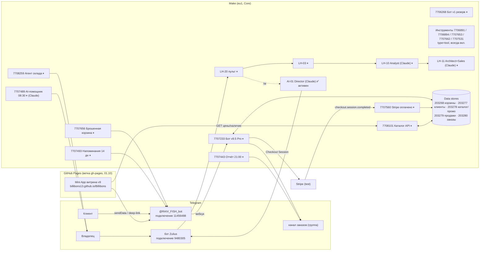

# FishDeck · ЭТАП A — аудит ядра RAIV FISH (только чтение)

Задача: **T-20261009-0036** · исполнитель 🔎 Аудитор систем · проверка: 🧭 Директор · 09.10.2026
Режим: **только чтение**. В Make, ботах, хранилищах, Stripe, GitHub Pages ничего не создано, не изменено, не запущено.
Сценарии-инструменты (`s77…` MCP-tools) **не вызывались** (вызов = запуск сценария).
Метки: **[ПРОВЕРЕНО: вызов]** — подтверждено свежим вызовом 09.10; **[ДОК]** — по документам команды; **[ПРЕДПОЛОЖЕНИЕ]**.
Секреты, токены, chat_id, URL вебхуков, записи хранилищ и данные клиентов в документ не попадают.

Опора на прежние аудиты (не переделывались, ключевые факты перепроверены):
`car-hunter/docs/AUDIT.md` (08.10), `raiv-fish-bot/agents/READINESS_CHECKLIST.md` (08.10),
`raiv-fish-bot/agents/reports/2026-10-07_credits.md`, `content-system/docs/ARCHITECTURE.md`,
`raiv-fish-bot/docs/AI_CHAT.md`, `lead-hunter/docs/ARCHITECTURE.md`.

---

## 0. Главное (коротко)

1. **Ядро RAIV FISH было рабочим до паузы и сейчас выключено владельцем.** Все сценарии магазина — `isActive: false`;
   события `stop` от аккаунта владельца 07.10 21:21:50–21:22:01 UTC видны в исполнениях 7707233, 7707560, 7708101,
   7707656, 7707443, 7707489, 7707493, 7708259. Ошибок (status 3) в последних исполнениях нет. **Бот сейчас клиентам не отвечает.**
   [ПРОВЕРЕНО: scenarios_list, executions_list]
2. **Последние успешные запуски** (UTC): бот 7707233 — 06.10 21:42; каталог API 7708101 — 07.10 07:12; отчёт 7707443 —
   07.10 19:00; AI-помощник 7707489 — 07.10 06:30; склад 7708259 — 07.10 07:01; оплата Stripe 7707560 — **только тест 01.10**
   (реальных оплат не было, Stripe-подключение — **test**). [ПРОВЕРЕНО: executions_list, connections_list]
3. **Что сейчас реально активно в Make (09.10):** AI-01 7852575 (4 запуска, последние 09.10 07:04 и 08:13 — status 1)
   и **новый проект Auto Deal Hunter** ADH-01/02/03/04 (7852688/690/709/696, создан 08.10 ~23:00, бот «Auto Deal Hunter Bot»).
   Всего сценариев в выдаче 70 (было 63), активных по счётчику организации — 18 (5 обычных + сценарии-инструменты).
   [ПРОВЕРЕНО: scenarios_list, organizations_get]
4. **Сценарии-инструменты RAIV (7706891, 7706894, 7707653, 7707662, 7707531) НЕ на паузе** — у них `type: tool`, `isActive: true`.
   Любой MCP-вызов может отправить сообщение от имени бота RAIV_Fish или сделать произвольный запрос к Stripe (GET/POST).
   Пауза владельца 07.10 их не касается. [ПРОВЕРЕНО: scenarios_get 7706891, 7707531]
5. **Кредиты Make:** израсходовано ≈ 5 954 из 10 000, **остаток ≈ 4 046** до сброса 30.10 22:42 UTC. [ПРОВЕРЕНО: organizations_get]
6. **Бренд «RAIV» зашит глубоко**: ~28 мест в `generate_blueprint.py` (4 языка), названия всех сценариев и хранилищ, Mini App
   (заголовок, шапка, ключи `localStorage` `raiv_cart`/`raiv_best`), Stripe product name «RAIV FISH — заказ», юр. черновики,
   OFFER, AI-промпты, username бота **@RAIV_FISH_bot** и канал **@raiv_fish1**, TikTok `@vasya_raivfish`. См. §5.
7. **Наблюдение (не ошибка, но нужно пояснение):** AI-01 получает вызовы 09.10 при выключенном LH-20 (его штатный источник).
   Значит, вебхук AI-01 дергает кто-то ещё (возможно, ручной тест инженера T-0034 или ADH). [ПРОВЕРЕНО: executions_list 7852575; источник — ПРЕДПОЛОЖЕНИЕ]

---

## 1. Карта архитектуры (как есть, 09.10)

---

## 2. Таблица компонентов

Статус: ✅ проверено вызовом · 📄 по документам · ❌ не работает · ⏸ на паузе (выключено владельцем 07.10).
Приоритет для перехода на FishDeck: P0 — блокирует запуск, P1 — до запуска, P2 — после запуска, P3 — по желанию.

| # | Компонент | Где | Статус | Факт (09.10) | Риск | Приоритет |
|---|---|---|---|---|---|---|
| 1 | Бот заказов v9.5 Pro | Make 7707233 (185 модулей, блюпринт ~166 КБ) | ⏸ (✅ до паузы) | 119 исп., посл. успех 06.10 21:42, stop 07.10 21:21:52; lastEdit 03.10; ошибок в посл. исп. нет | Большой блюпринт: правки только импортом владельца / «Deployer»; все тексты бренда внутри | **P0** |
| 2 | Вебхук бота | хук «RAIV_Fish Bot — Telegram webhook» → 7706268 (резерв), STAGING-хук → 7707233 | 📄 | по `hooks_list`: очередь хука 7706268 = 2, хука 7707233 = 0; какой URL сейчас стоит у Telegram — проверялось 08.10 через 7706894 (вызов = запуск, сегодня не делался) | Путаница рабочий/резерв при переключении бота | P1 |
| 3 | Бот v1 (резерв) | Make 7706268 | ⏸ | 37 исп., 11 ошибок (за весь период), lastEdit 30.09 | Устаревшая версия; при откате — без корзины | P3 |
| 4 | Оплата Stripe | Make 7707560 + хук Stripe `checkout.session.completed` | ⏸ | реальный запуск 1 раз (01.10, тест 4242) + 2 повтора; stop 07.10 | Подключение **test**; live-ключ не выдан; product name «RAIV FISH — заказ» | **P0** (для онлайн-оплаты) |
| 5 | Каталог API для витрины | Make 7708101 | ⏸ (✅ до паузы) | 28 исп., посл. успех 07.10 07:12; в очереди хука 3 запроса | Пока выключен, витрина не получает живые цены | P0 |
| 6 | Загрузка каталога (разово) | Make 7708099 | ⏸ | 1 исп. 01.10 (44 оп.) | — | P3 |
| 7 | Mini App витрина | GitHub Pages, ветка `gh-pages` (коммит 01.10 «Витрина v9»), генератор `raiv-fish-bot/generate_miniapp.py` | 📄 / ✅ (содержимое ветки проверено git) | опубликованный `index.html` содержит «RAIV FISH», `RAIV_FISH_bot`, ключи `raiv_cart`/`raiv_best`; 25 фото; страница по HTTPS из сессии недоступна (прокси) | Путь `/Billibons/` — имя репозитория, не бренд; смена ключей localStorage сбросит корзины клиентов | P1 |
| 8 | Кнопка меню → витрина | Make 7810222 | ⏸ (разовый) | 2 запуска 06.10, status 1 | По чек-листу 08.10 кнопка у владельца не видна (❌ 3.8) | P2 |
| 9 | Брошенная корзина | Make 7707656 (каждый час) | ⏸ | счётчик 166 исп., 0 ошибок; в выдаче `executions_list` за 01–07.10 записей нет (пустые прогоны не логируются — [ПРЕДПОЛОЖЕНИЕ]) | Сообщения клиентам с брендом | P1 |
| 10 | Напоминания 14 дней | Make 7707493 | ⏸ | 8 исп., stop 07.10 21:21:57 | Сообщения клиентам с брендом | P1 |
| 11 | Агент склада 09:00 | Make 7708259 | ⏸ (✅ до паузы) | посл. успех 07.10 07:01 | — (только владельцу) | P2 |
| 12 | Отчёт 21:00 | Make 7707443 | ⏸ (✅ до паузы) | посл. успех 07.10 19:00 | Шаблон с брендом | P2 |
| 13 | AI-помощник 08:30 | Make 7707489 (Claude, 11 модулей) | ⏸ (✅ до паузы) | посл. успех 07.10 06:30 | Промпт с брендом и городами | P2 |
| 14 | Инструмент Telegram API (чат) | 7706891 | ✅ (`scenarios_get`: tool, активен) | не вызывался | Может писать от имени бота в любой чат | P1 (безопасность) |
| 15 | Инструмент updates/webhook | 7706894 | 📄 (имя MCP-инструмента, подключение 11456488) | не вызывался | Может менять вебхук бота | P1 |
| 16 | Инструмент Telegram API (JSON) | 7707653 | 📄 | не вызывался | как №14 | P1 |
| 17 | Инструмент HTTP GET | 7707662 | 📄 | не вызывался | — | P3 |
| 18 | Инструмент Stripe API (test) | 7707531 | ✅ (`scenarios_get`: tool, GET/POST на подключение 11458868) | не вызывался | Произвольные POST к Stripe; при переходе на live-ключ станет опасным | P1 |
| 19 | Чтение корзины (тест) | 7707208 | 📄 | использует хранилище корзин | — | P3 |
| 20 | Подключение бота RAIV_Fish | Make 11456488 (+ неиспользуемый дубль 11456487) | ✅ | 12 сценариев используют | Смена бота = смена подключения во всех 12 | P0 |
| 21 | Подключение Stripe | Make 11458868 «RAIV FISH Stripe (test)» | ✅ | используют 7707233, 7707531 | Название с брендом; режим test | P0 |
| 22 | Хранилища RAIV | 203268 корзины (4 зап.), 203277 клиенты (2), 203278 каталог+промокоды (44), 203279 продажи по дням (10), 203280 заказы (5) | ✅ (только счётчики) | всего ≈ 10,6 КБ; лимит организации 10 МБ на все хранилища, резерв занят (10 × 1 МБ) | Нельзя создать новое хранилище без уменьшения резерва; переименование хранилищ безопасно (ID не меняется) | P2 |
| 23 | AI-01 Director | Make 7852575 (Claude Sonnet, бот Zulius) | ✅ активен | 4 исп., все status 1; последние 09.10 07:04 и 08:13 | Вызовы при выключенном LH-20 — источник уточнить; промпт «Директор RAIV FISH» | P2 |
| 24 | LH-20 пульт (Zulius) | Make 7789394; новая версия `lead-hunter/blueprints/LH-20.json` с `/ai` | ⏸ | 51 исп., stop 07.10 21:21:50; импорт новой версии ждёт владельца | Без LH-20 команда `/ai` не работает | P2 (не бренд) |
| 25 | LH-03 / LH-10 / LH-11 (Claude) | Make 7789167 / 7789247 / 7810124 | ⏸ | 47 / 37 / 13 исп., 0 ошибок по счётчику; LH-11 — самый дорогой (≈ 1 712 кр за 13 исп.) | Брендом RAIV не завязаны (Lead Hunter — отдельная линия) | P3 |
| 26 | Auto Deal Hunter ADH-01…04 | Make папка «Auto Deal Hunter» | ✅ активны | созданы 08.10; 1 ошибка в ADH-01, 1 — в 7852684 | Тратят кредиты параллельно с переходом | вне задачи, учесть в бюджете |
| 27 | Кредиты Make | организация 8518579, Core | ✅ | остаток ≈ 4 046 до 30.10 | Включение ядра + ADH + AI-01 могут не уложиться | **P0** (планирование) |
| 28 | Юр. черновики | `raiv-fish-bot/legal/` (Impressum, Datenschutz, тексты для бота) | 📄 | черновики, не опубликованы; владелец: «пока не нужно» | Для продаж в DE обязательны (Abmahnung) | **P0** |
| 29 | OFFER / прайс услуг | `raiv-fish-bot/OFFER.md`, `PRICES.md`, `offer_business.html`, PDF | 📄 | B2B-предложение «бот как продукт», демо @RAIV_FISH_bot | Ссылки на демо сломаются при смене бота | P2 |
| 30 | Канал @raiv_fish1, TikTok, Instagram | ссылки в `generate_blueprint.py` | 📄 | бот — не админ канала (чек-лист 5.1 ❌) | Ссылки в «Контактах» ведут на старый бренд | P1 |

---

## 3. AI-агенты

| Агент | Модель / где | Что делает | Статус | Бренд в промпте |
|---|---|---|---|---|
| AI-01 «Директор RAIV FISH» | Claude Sonnet, Make 7852575, генератор `raiv-fish-bot/generate_ai_chat.py` | чат владельца в Zulius | ✅ активен, 4/4 успешно | да: «RAIV FISH — магазин… Эдделак, Марне, Брунсбюттель, Хайде», канал |
| AI-помощник 08:30 | Claude, 7707489, генератор `generate_pro.py` | 3 совета владельцу по живому каталогу и продажам | ⏸ | да: «магазин RAIV FISH (доставка: …)» |
| LH-10 Analyst | Claude Haiku, 7789247 | оценка заявок Lead Hunter | ⏸ | нет (Lead Hunter) |
| LH-11 Architect + Sales | Claude Sonnet, 7810124 | бриф + КП для лида | ⏸ | нет |
| ADH-02 Inspector/Analyst | Make 7852690 | анализ объявлений авто | ✅ | нет (вне задачи) |

---

## 4. Хранилища — структура и объём (без записей)

| ID | Название | Записей | Размер | Кто использует |
|---|---|---|---|---|
| 203268 | RAIV_Fish — корзины покупателей | 4 | 306 Б | 7707233, 7707656, 7707208 |
| 203277 | RAIV_Fish — клиенты | 2 | 648 Б | 7707233, 7707489, 7707656, 7707493 |
| 203278 | RAIV_Fish — промокоды (фактически каталог + промокоды) | 44 | 6,5 КБ | 7707233, 7707489, 7708259, 7708099, 7708101 |
| 203279 | RAIV_Fish — продажи по дням | 10 | 952 Б | 7707233, 7707443, 7707489, 7707656 |
| 203280 | RAIV_Fish — заказы | 5 | 2,2 КБ | 7707233, 7707560 |

Вывод: клиентская база маленькая (2 клиента, 5 заказов) — **цена смены бота для существующих клиентов низкая**.

---

## 5. Где живёт бренд RAIV (grep по репозиторию, 09.10)

| Место | Что именно | Как менять |
|---|---|---|
| `raiv-fish-bot/generate_blueprint.py` | 28 вхождений: приветствие `/start` (ru/de/es/uk), «ВЕСЬ ПРАЙС RAIV FISH» (4 языка), «Контакты RAIV FISH», реферальные тексты, заголовок заказа в канал, `BOT_USER = "RAIV_FISH_bot"`, ссылки @raiv_fish1, TikTok `vasya_raivfish`, имя сценария | правка генератора → новый блюпринт → **импорт владельцем** |
| Переводы v9.6 | `raiv-fish-bot/backup/v9_6_lang_blueprint.json` (188 КБ, 35 вхождений) — ещё не импортирован; рабочий 7707233 = v9.5 | v9.6 и ребрендинг выпускать **одним** импортом |
| Mini App | `miniapp/template.html` (title, шапка «🐟 RAIV FISH», кнопка «Добавить RAIV FISH на главный экран», текст игры, `RAIV_FISH_bot`), ключи `raiv_cart`/`raiv_best`; цвета `#e8572a`, фон `#ffe6d5→#ffd0b8` | правка шаблона → `generate_miniapp.py` → коммит в `gh-pages`; **ключи localStorage не менять** (технические, клиент их не видит) |
| Username бота | **@RAIV_FISH_bot** | username в BotFather не переименовывается «на месте» (можно освободить и занять другой, но старые ссылки сломаются); **display name меняется свободно** |
| Канал / соцсети | @raiv_fish1, TikTok `@vasya_raivfish` | решение владельца |
| Юр. документы | `legal/Impressum_DE.md`, `legal/Datenschutz_DE.md`, `legal/Bot_Texte_privacy_impressum.md` | заменить бренд, бот, URL витрины |
| OFFER / продажи бота | `OFFER.md`, `offer_business.html`, `OFFER_Business_RAIV_FISH.pdf`, `README.md`, `CLIENT_GUIDE.md`, `SELLER_CHECKLIST.md`, `MARKET_ANALYSIS.md` | заменить демо-бот и бренд |
| Stripe | `generate_blueprint.py`: `product_data[name] = "RAIV FISH — заказ"`; `statement_descriptor` в коде **не задаётся** (берётся из настроек аккаунта Stripe — видит только владелец) | правка генератора + настройка в Stripe Dashboard владельцем |
| Отчёты / склад / корзина / AI | `generate_daily_report.py`, `generate_stock_agent.py`, `generate_abandoned.py`, `generate_pro.py`, `generate_ai_chat.py` | правка генераторов, малые блюпринты можно обновить через API после «да» владельца |
| Имена в Make | все сценарии «RAIV_Fish …», хранилища «RAIV_Fish — …», подключения, папка «RAIV Director» | переименование не меняет ID — безопасно, но не обязательно |
| Домен / GitHub Pages | `billibons13.github.io/Billibons/` — бренда в пути нет | можно оставить; свой домен — по желанию |
| Прочее | `content-system/docs/ARCHITECTURE.md` (контент-система RAIV FISH), `platform/` (пакет `raiv_platform`), агенты директора `raiv-fish-bot/agents/*` | внутренние имена — не менять (P3) |

---

## Отчёт этапа A

- **Проверено:** `scenarios_list` (70 сценариев), `hooks_list`, `data-stores_list` (только счётчики), `connections_list`,
  `organizations_get`, `executions_list` для 7707233, 7707560, 7708101, 7707656, 7707443, 7707489, 7707493, 7708259, 7810222,
  7852575; `scenarios_get` 7706891, 7707531; содержимое ветки `gh-pages` (git, только чтение); grep бренда по репозиторию.
- **Изменено:** ничего.
- **Сохранено:** все сценарии, хранилища, подключения, вебхуки, бот, витрина — без изменений; пауза владельца 07.10 в силе.
- **Тесты (read-only, пройдены):** статусы и счётчики сценариев получены; последние исполнения ядра — status 1, ошибок нет;
  события stop 07.10 подтверждены; хранилища 5/5 найдены, счётчики сняты; ветка gh-pages читается; секретов в документе нет.
- **Не проверено (причина):** живая страница GitHub Pages и `getWebhookInfo` (из сессии DNS/прокси закрыты, а сценарии-инструменты
  запускать запрещено этапом); настройки Stripe Dashboard (нет доступа).
- **Следующие шаги:** этап B (`FISHDECK_PROFILE.md`), этап C (`MIGRATION_PLAN.md`); владельцу — вопросы в `MIGRATION_PLAN.md` §7.
